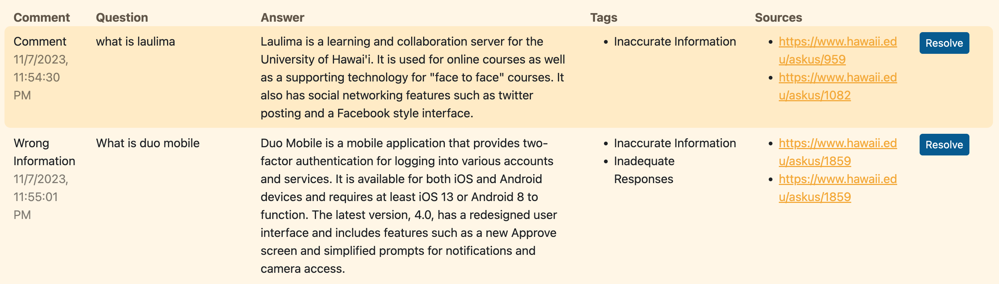

# Overview
Problem: The current UH ITS AskUs webpage has an outdated search system which makes it difficult for users to find the answers that they are looking for. Simple searches like "How do I connect to the wifi?", gives out a list of articles for the user to look through. This can be very time consuming for users to use just to find an answer to a simple question. Because of the non-user friendly design of the current ITS website, many users go to a Help Desk assistant instead of using the current Ask Us search bar.

Solution: Our team will create a ChatBot with the use of modern AI tools that will improve on the current search functionality. This tool will allow users to find the answers they need using conversational language without the need for a Help Desk assistant.

# Links
- [GitHub Organization]([https://github.com/darkmode-askus/])
- [Team Contract]([https://docs.google.com/document/d/10KI7QzybiLFSjhUuJa4Rv9LNcAiDDKtMt7nOhDZN9LM/edit?usp=sharing/])
- [M1 Project page]([https://github.com/orgs/darkmode-askus/projects/6/])

# User's Guide

## Landing
Here the user is able to receive announcements and ITS resources that they can access.

## Log In Page
The user needs to login in order to use the chatbot and post questions on the FAQ page.

## Chatbot
Here the user can ask the chatbot any questions relating to ITS. The chatbot will produce an answer from the ITS documents and send it to the user.

## FAQ Page
All of the frequently asked questions and answers will be posted on this page. Answers will be provided by the admin.

## Forum Page
Users will able to post their experiences or issues with the chatbot. The users can also post additional ITS questions that require more assistance. These posts can be answered by other users at UH. 

## Report Page
Here users are able to report any issues or inaccurate answers with the AI chat bot.

# Team
This application is designed, implemented, and maintained by [Kaylee Agorilla]([https://github.com/kayleeagorilla/]), [Malisa Lo]([https://github.com/malisalo/]), and [Micah Tilton]([https://github.com/micahtilton/]).
