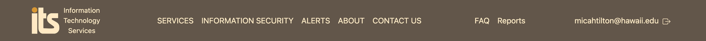
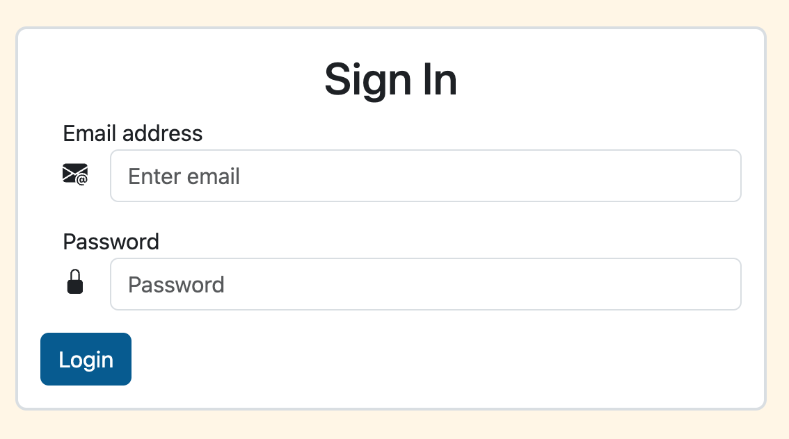
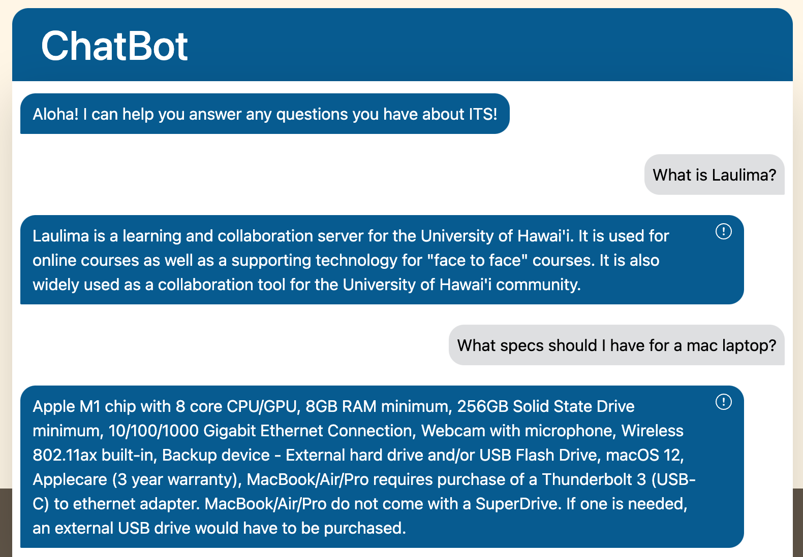
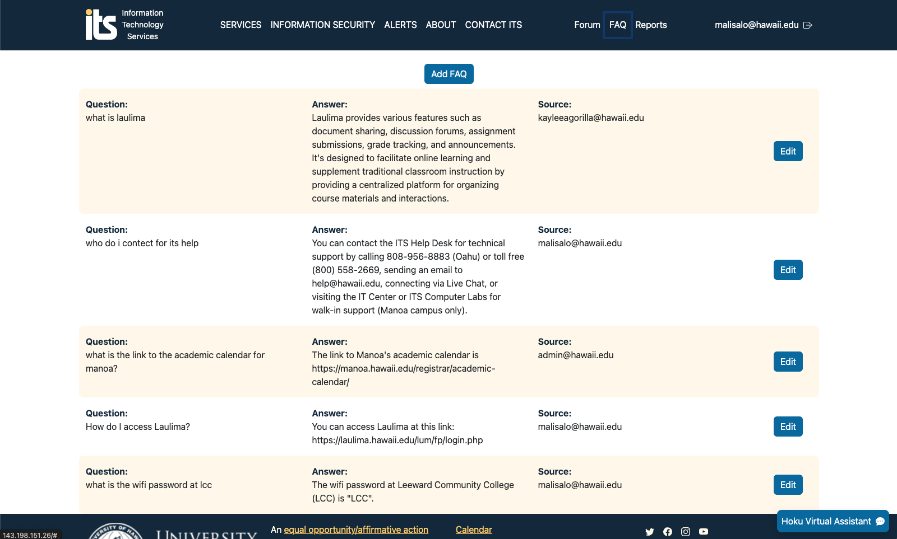
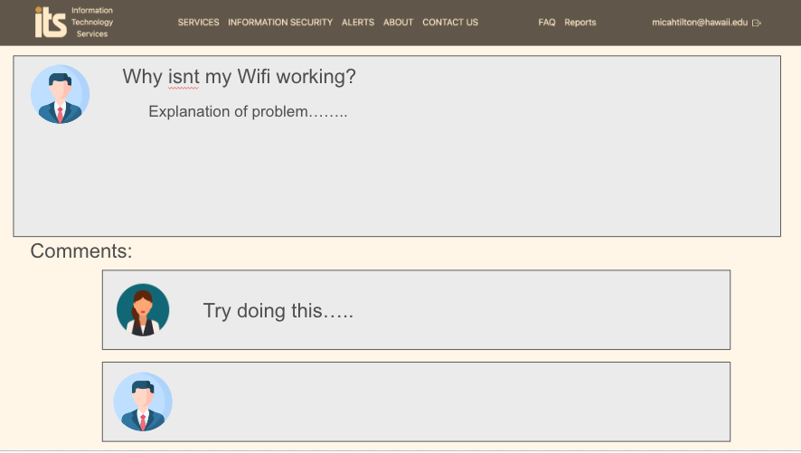
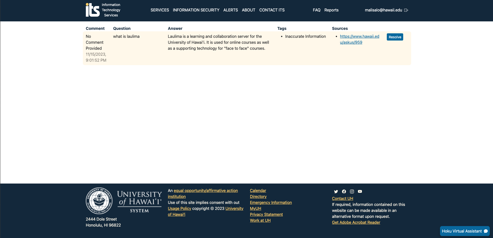
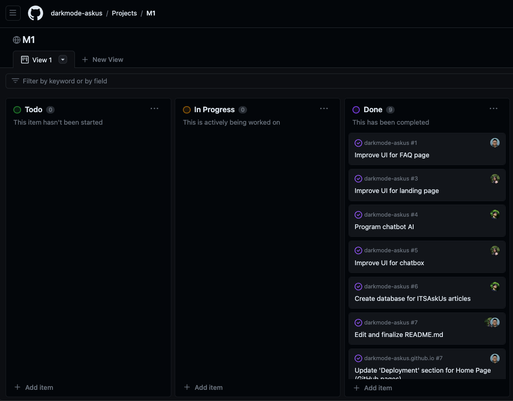

    
    <h1>Ask Hoku</h1>
    <h3>Team DarkMode - ITS AskUs (HACC)</h3>

## Table of contents

* [Overview](#overview)
* [Links](#links)
* [User's Guide](#users-guide)
* [Deployment](#deployment)
* [Team](#team)

# Overview
Problem: The current UH ITS AskUs webpage has an outdated search system which makes it difficult for users to find the answers that they are looking for. Simple searches like "How do I connect to the wifi?", gives out a list of articles for the user to look through. This can be very time consuming for users to use just to find an answer to a simple question. Because of the non-user friendly design of the current ITS website, many users go to a Help Desk assistant instead of using the current Ask Us search bar.

Solution: Our team will create a ChatBot with the use of modern AI tools that will improve on the current search functionality. This tool will allow users to find the answers they need using conversational language without the need for a Help Desk assistant.

## Links
- [GitHub Organization](https://github.com/darkmode-askus/)
- [Team Contract](https://docs.google.com/document/d/10KI7QzybiLFSjhUuJa4Rv9LNcAiDDKtMt7nOhDZN9LM/edit?usp=sharing/)
- [M1 Project page](https://github.com/orgs/darkmode-askus/projects/6/)

# User's Guide

This section provides a walkthrough of the user interface and its capabilities.

### Landing

The landing page is presented to users and is what they see when they first load the application. Here users are able to receive announcements and ITS resources that they can access. 

### Log In Page

The user needs to login in order to use the chatbot and report any messages from the chatbot. Admins can also login to view the FAQ or report page and make any modifications. 

### Chatbot

Users can ask the chatbot any questions relating to ITS. The chatbot will produce an answer from the ITS documents and send it to the user.

### FAQ Page

All of the frequently asked questions and answers will be posted on this page. Answers will be provided by the admin. Admins have the ability to edit any existing FAQs or add a new one.

### Forum Page

Users will able to post their experiences or issues with the chatbot. The users can also post additional ITS questions that require more assistance. These posts can be answered by other users, faculty, or admins at UH. Admins have the additional capability to delete or modify any posts.

### Report Page

Here users are able to report any issues or inaccurate answers with the AI chatbot. Admins can see these reports and have the choice to resolve them or simply delete it.

# Deployment

Our application was deployed using Digital Ocean. The link to our application is [here](http://143.198.151.26/).

## Development History

The development process conformed to [Issue Driven Project Management](https://courses.ics.hawaii.edu/ics314f19/modules/project-management/) practices. In quick summary:

- Development consists of a sequence of Milestones with each Milestone holds a set of tasks.
- Each task is added, assigned to a single developer, and kept track of using a GitHub Issue.
- The work to accomplish each task has its own git branch with the name "issue-XX", XX represents the number of the issue.
- Once the task has been completed, the issues gets closed and the branch will be merged into main.
- The GitHub Project board for each Milestone organizes our tasks into 3 states, todo, in progress, and complete.

Our development history is displayed in the sections below.

### Milestone 1: Mockup development

The goal of Milestone 1 is to improve the UI for the FAQ and report pages along with the chatbox. In addition, we plan to continue programming the chatbot AI and expand the databases to accomplish the bonus challenges for HACC. We also want to start on creating a mockup UI for the forum page and edit our README.md.

#### Milestone 1 was managed using [GitHub Project Board M1](https://github.com/orgs/darkmode-askus/projects/6/views/1):

# Team

This application is designed, implemented, and maintained by team DarkMode which consists of [Kaylee Agorilla](https://kayleeagorilla.github.io/), [Malisa Lo](https://malisalo.github.io/), and [Micah Tilton](https://micahtilton.github.io/).
