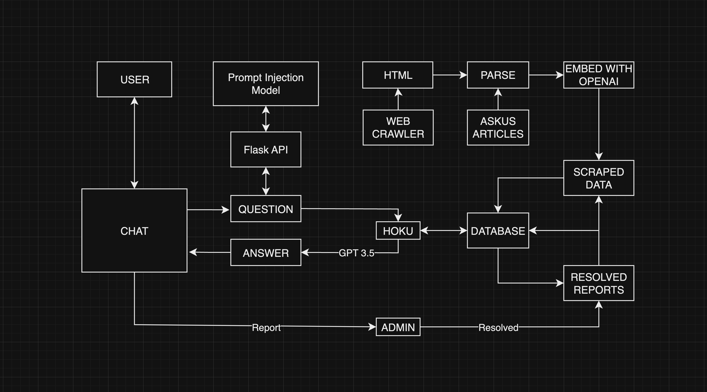
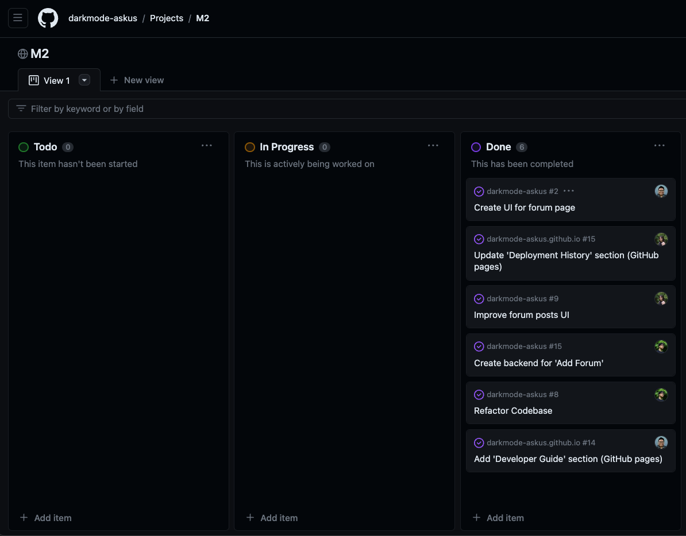

<hr/>

## Table of contents

* [Overview](#overview)
* [Links](#links)
* [User's Guide](#users-guide)
* [Community Feedback](#community-feedback)
* [Developer's Guide](#developers-guide)
* [Continuous Integration](#continuous-integration)
* [Diagram](#diagram)
* [Deployment](#deployment)
* [Team](#team)

<hr/>

<div align="center">
    
    <h1>Ask Hoku</h1>
    <h3>Team DarkMode - ITS AskUs (HACC)</h3>
</div>

# Overview
Problem: The current UH ITS AskUs webpage has an outdated search system which makes it difficult for users to find the answers that they are looking for. Simple searches like "How do I connect to the wifi?", gives out a list of articles for the user to look through. This can be very time consuming for users to use just to find an answer to a simple question. Because of the non-user friendly design of the current ITS website, many users go to a Help Desk assistant instead of using the current Ask Us search bar.

Solution: Our team will create a ChatBot with the use of modern AI tools that will improve on the current search functionality. This tool will allow users to find the answers they need using conversational language without the need for a Help Desk assistant.

## Links
- [GitHub Organization](https://github.com/darkmode-askus/)
- [Team Contract](https://docs.google.com/document/d/10KI7QzybiLFSjhUuJa4Rv9LNcAiDDKtMt7nOhDZN9LM/edit?usp=sharing/)
- [Link to Deployed Application](http://143.198.151.26/)

# User's Guide

This section provides a walkthrough of the user interface and its capabilities.

### Landing

The landing page is presented to users and is what they see when they first load the application. Here users are able to receive announcements and ITS resources that they can access. 


### Log In Page

The user needs to login in order to use the chatbot and report any messages from the chatbot. Admins can also login to view the FAQ or report page and make any modifications. 


### Chatbot

Users can ask the chatbot any questions relating to ITS. The chatbot will produce an answer from the ITS documents and send it to the user.


### FAQ Page

All of the frequently asked questions and answers will be posted on this page. Answers will be provided by the admin. Admins have the ability to edit any existing FAQs or add a new one.


### Forum Page

Users will able to post their experiences or issues with the chatbot. The users can also post additional ITS questions that require more assistance. These posts can be answered by other users, faculty, or admins at UH. Admins have the additional capability to delete or modify any posts.


### Report Page

Here users are able to report any issues or inaccurate answers with the AI chatbot. Admins can see these reports and have the choice to resolve them or simply delete it.


# Community Feedback

We are interested in your experience using Ask Hoku! Tell us any feedback you have for us by taking a couple of minutes to fill out the [Ask Hoku Feedback Form](https://docs.google.com/forms/d/e/1FAIpQLSccZIieXWxG5SDq2Kx0qS6MaKYGX9pWmV9jYPPGtBiyM8aWYw/viewform). It contains only five short questions and will help us understand how to improve the system.

# Developer's Guide

This section will guide Meteor developers through the process of downloading, installing, and running for those who wish to use our code and modify the system.

## Installation

First, [install Meteor](https://www.meteor.com/install).

Second, visit the [Ask Hoku application github page](https://github.com/darkmode-askus/darkmode-askus), and click the "Use this template" button to make a copy of this application and create your own repository. Then download the copy of the repo to your local computer.

Third, cd into the darkmode-askus/app directory and install libraries using:
```
$ meteor npm install
```

Fourth, run the system with:
```
$ meteor npm run start
```

The application will appear at [http://localhost:3000](http://localhost:3000) if all goes well.

If any errors occur during the installation process and you are unable to run the application at [http://localhost:3000](http://localhost:3000), then simply stop the application from running and start it again by following these commands:
```
$ control+c
$ meteor npm run start
```

## Reset project

If you wish to reset the project, run the following commands:
```
$ cd app
$ meteor reset
$ meteor npm run start
```

## Create Meteor settings directory

To create the Meteor settings directory, run the following commands:
```
$ cd app
$ mkdir config
$ cd config
$ touch settings.development.json
```

## Python venv setup

To create the Python venv, run the following commands:
```
$ cd data-extraction
$ python3 -m venv venv
$ source venv/bin/activate
$ pip3 install -r requirements.txt
```

## Starting Flask server

To start the Flask server, run the following commands:
```
$ cd api
$ python main.py
```

## Continuous Integration

[](https://github.com/darkmode-askus/darkmode-askus/actions/workflows/ci.yml)

Ask Hoku uses [GitHub Actions](https://docs.github.com/en/actions) to automatically run and check for any errors each time a commit is made to the default branch. You can see the results of all recent “workflows” at [https://github.com/darkmode-askus/darkmode-askus/actions](https://github.com/darkmode-askus/darkmode-askus/actions).

The workflow definition file is located at [.github/workflows/ci.yml](https://github.com/darkmode-askus/darkmode-askus/blob/main/.github/workflows/ci.yml) and is easy to implement.

# Diagram

The diagram below shows how both the front and backend work hand in hand with each other to give users the best experience possible. It also shows how Hoku proccesses the user's input and how it responds back to the user. 



# Deployment

Our application was deployed using Digital Ocean. The link to our application is [here](http://143.198.151.26/).


## Development History

The development process conformed to [Issue Driven Project Management](https://courses.ics.hawaii.edu/ics314f19/modules/project-management/) practices. In quick summary:

- Development consists of a sequence of Milestones with each Milestone holds a set of tasks.
- Each task is added, assigned to a single developer, and kept track of using a GitHub Issue.
- The work to accomplish each task has its own git branch with the name "issue-XX", XX represents the number of the issue.
- Once the task has been completed, the issues gets closed and the branch will be merged into main.
- The GitHub Project board for each Milestone organizes our tasks into 3 states, todo, in progress, and complete.

Our development history is displayed in the sections below.

### Milestone 1:

The goal of Milestone 1 is to improve the UI for the FAQ and report pages along with the chatbox. In addition, we plan to continue programming the chatbot AI by expanding the databases to accomplish the bonus challenges for HACC and focus on prompt injections. We also finalized our README.md and updated our GitHub Pages.

#### Milestone 1 was managed using [GitHub Project Board M1](https://github.com/orgs/darkmode-askus/projects/6/views/1):


### Milestone 2:  

The goal of Milestone 2 is to focus on creating the Forums page and adding a 'Add Forum' button. We are also looking into allowing users to comment on other users' posts. Although we got majority of the features working, some of our code requires clean up.

#### Milestone 2 was managed using [GitHub Project Board M2](https://github.com/orgs/darkmode-askus/projects/7/views/1):  



### Milestone 3:

The goal of Milestone 3 is to finalize the Forums page and implement Google OAuth for users to login with their hawaii.edu account.

#### Milestone 3 was managed using [GitHub Project Board M3](https://github.com/orgs/darkmode-askus/projects/8):


# Team  
This application is designed, implemented, and maintained by team DarkMode which consists of [Kaylee Agorilla](https://kayleeagorilla.github.io/), [Malisa Lo](https://malisalo.github.io/), and [Micah Tilton](https://micahtilton.github.io/).
